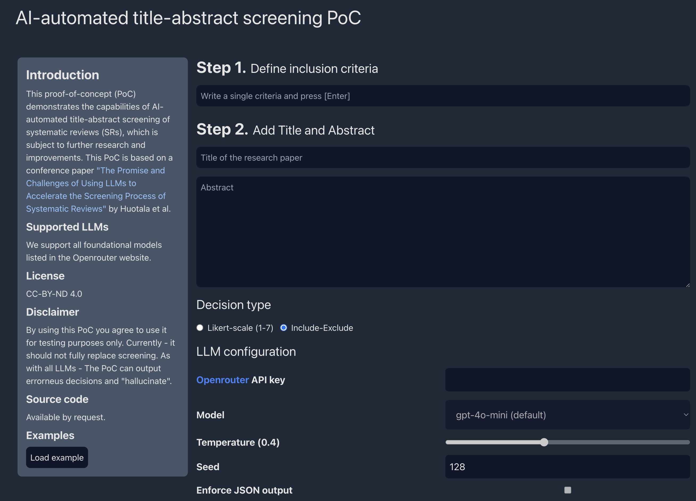

# AI-automated screening PoC

## Introduction

This proof-of-concept (PoC) application demonstrates the current capabilities of AI-automated title-abstract screening of systematic reviews (SRs). This PoC is based on a conference paper "The Promise and Challenges of Using LLMs to Accelerate the Screening Process of Systematic Reviews" by Huotala et al.

## Technology

### Front-end

TypeScript, React, Tailwind CSS, Vite, Wouter, Zod, Redux

### Back-end

Python, FastAPI, PostgreSQL, SQLAlchemy, Alembic

## Requirements

Node.js v22 LTS and Python 3.9 are required.

## Running in development mode

Run `docker compose -f docker-compose-dev.yml up --watch`

Open up the client: [http://localhost:3000](http://localhost:3000)

`/api` is proxied to the backend container, e.g. `http://localhost:3000/api/v1/health` will be proxied to `http://localhost:8080/api/v1/health`.

API docs: [http://localhost:3000/documentation](http://localhost:3000/docs)

Server: [http://localhost:8080](http://localhost:3000)

## Running in production mode

Run `docker compose -f docker-compose.yml up`

## Tests

Run `npm test`

## Supported LLMs

Currently, we support models provided via Openrouter.

## License

CC-BY-ND 4.0

## References

Huotala, A., Kuutila, M., Ralph, P., & Mäntylä, M. (2024). The promise and challenges of using llms to accelerate the screening process of systematic reviews. Proceedings of the 28th International Conference on Evaluation and Assessment in Software Engineering, 262–271. https://doi.org/10.1145/3661167.3661172
