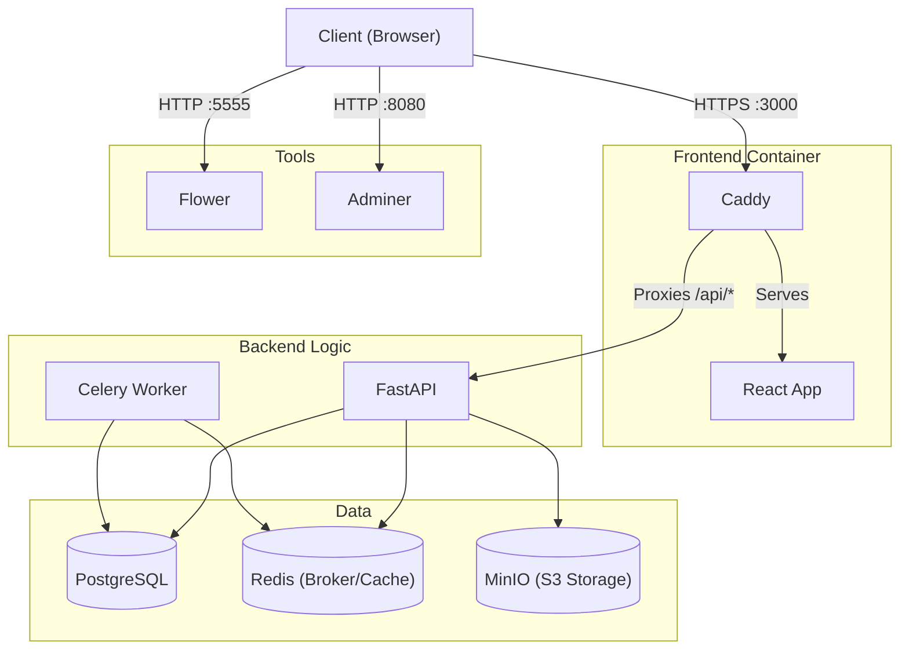

# Architecture

## Port Mapping

| Service | Port | Container port|
| --------------- | --------------- | --------------- |
| Frontend (https) | 3000 | 9443 |
| Frontend redir (http)| 3080 | 9080 |
| Backend API | --- | 8080 |
| Adminer | 8080  | 8080 |
| Flower | 5555 | 5555|
| MinIO API | 9000 | 9000|
| MinIO Console | 9001 | 9001|
| PostgreSQL | 5432| 5432|
| Redis | 6379 | 6379 |

