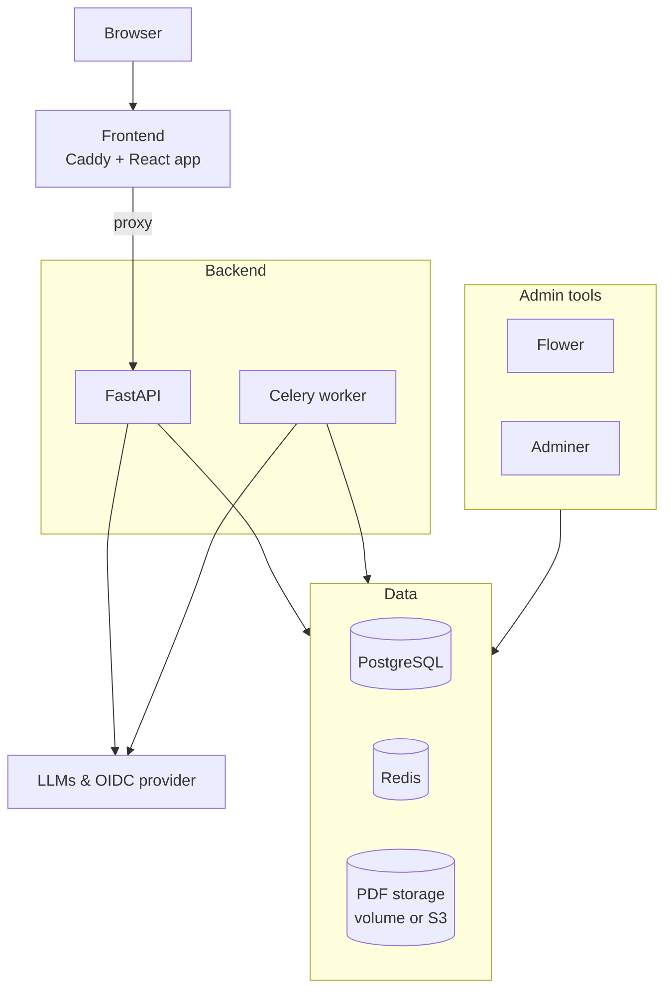

# Architecture

The diagram shows the production stack (`make start-prod`, [docker-compose.yml](../docker-compose.yml)). The development stack ([docker-compose-dev.yml](../docker-compose-dev.yml)) is the same except that the frontend is the Vite dev server, which proxies API requests to the backend, instead of Caddy serving a built bundle.

## Services

| Service | Role |
| --- | --- |
| Frontend | Caddy serves the built React app and reverse-proxies backend routes (`/api`, `/login`, `/logout`, `/register-and-privacy-policy`, `/openapi.json`, `/docs`). In development the Vite dev server does both jobs. |
| Backend | FastAPI application. Runs database migrations on startup when `RUN_MIGRATIONS=true`. |
| Celery | Runs the screening jobs in the background: LLM calls, and for PDF screening the text extraction and embeddings. |
| PostgreSQL | Main database, see [database.md](database.md). It must be the `pgvector` image, because a migration enables the `vector` extension. Embeddings are currently stored as JSONB, though. |
| Redis | Celery broker, and pub/sub channel that carries live progress events (published by the API and the workers) to the browser through the backend. |
| PDF storage | Uploaded PDFs. By default a Docker volume (`pdf_data`) mounted into the backend and Celery containers (`STORAGE_BACKEND=local`). With `STORAGE_BACKEND=s3` any S3-compatible service is used instead, configured with the `S3_*` variables. No S3 service is part of the compose stacks. |
| Flower | Celery monitoring UI. |
| Adminer | Database GUI. |

## LLMs and OIDC provider

- **LLMs:** the screening models are called through OpenRouter, OpenAI or a local OpenAI-compatible server, depending on what the user selects in the UI. See [local-models.md](local-models.md) for local models.
- **OIDC provider:** users log in through OpenID Connect. The issuer is set with `OIDC_ISSUER_URL` and defaults to the University of Helsinki login.

## Port mapping

All host ports are bound to `127.0.0.1` only. Containers are named with the environment as a suffix (for example `backend_dev`), and the dev and test stacks use the same compose file with different Docker Compose project names.

| Service | Container port | Prod | Dev | Test |
| --- | --- | --- | --- | --- |
| Frontend (HTTPS) | 9443 (prod) / 3000 (dev, test) | 3000 | 3001 | 3002 |
| Frontend HTTP redirect to HTTPS | 9080 | 3080 | - | - |
| Backend API | 8080 | not published | 8090 | 8090 |
| Backend debugger | 5678 | 5678 | 5678 | 5678 |
| Celery debugger | 5679 | 5679 | 5679 | 5679 |
| Flower | 5555 | 5555 | 5556 | 5557 |
| Adminer | 8080 | 8080 | 8081 | 8082 |
| PostgreSQL | 5432 | 5432 | 5432 | 5432 |
| Redis | 6379 | 6379 | 6379 | 6379 |

The prod, dev and test columns are the defaults set by `make start-prod`, `make start-dev` and `make start-test` (the frontend, Flower and Adminer ports can be overridden with `FRONTEND_PORT`, `FLOWER_PORT` and `ADMINER_PORT`). PostgreSQL, Redis and the debugger and backend ports are fixed in the compose files, so only one stack can run at a time.

## Kubernetes / OpenShift

The [manifests/](../manifests/) folder holds the staging and production deployments. They run the same `server` and `client` images that the [Dockerfile](../Dockerfile) builds and that the GitHub workflows push, plus Redis. PostgreSQL, Flower and Adminer are not defined there, so the database has to be provided separately.
