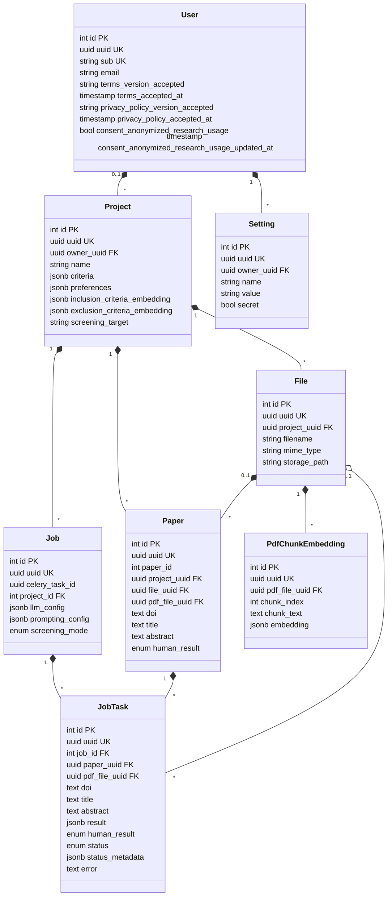

# Database

PostgreSQL, accessed with SQLAlchemy (async) and migrated with Alembic. The tables are defined in [server/src/db/models/](../server/src/db/models/) and the migrations are in [server/migrations/versions/](../server/migrations/versions/).

Relationship symbols: a filled diamond (`*`) means the parent owns the child and deleting the parent deletes the children (`ON DELETE CASCADE`). The hollow diamond (`o`) means the child is only linked and its reference is cleared when the parent is deleted (`ON DELETE SET NULL`). The numbers are the multiplicities: `1` exactly one, `0..1` optional, `*` many.

## Notes

- Enum values: `screening_target` is `PAPER` or `GITHUB_REPOSITORY`. `human_result` (on `paper` and `jobtask`) is `INCLUDE`, `EXCLUDE` or `UNSURE`. `job.screening_mode` is `TEXT`, `PDF` or `AUTOMATIC`. `jobtask.status` is `NOT_STARTED`, `PENDING`, `RUNNING`, `DONE`, `ERROR` or `CANCELLED`.
- Unique constraints besides the `uuid` columns: `sub` on `user`, (`owner_uuid`, `name`) on `setting`, (`project_uuid`, `paper_id`) on `paper` and (`pdf_file_uuid`, `chunk_index`) on `pdf_chunk_embedding`.
- `paper.file_uuid` is the imported CSV file and `paper.pdf_file_uuid` is the attached full-text PDF. Both reference `file`.
- `jobtask.result` holds the LLM result.
- Every table also has `created_at` and `updated_at` (timestamp with time zone).
- Each table has an integer `id` primary key and a separate `uuid` column. Some foreign keys reference the integer `id` (`job.project_id`, `jobtask.job_id`) and others the `uuid` (everything else), so check the model when writing a join.
- All foreign keys use `ON DELETE CASCADE`, except `jobtask.pdf_file_uuid`, which is set to `NULL`. Deleting a project removes its files, papers and jobs, and deleting a user removes their projects and settings.
- A paper must have a source file: the check constraint `ck_paper_has_source_file` requires `file_uuid` or `pdf_file_uuid` to be set.
- `jobtask` copies `doi`, `title` and `abstract` from the paper when the job is created, so that a task keeps the text that was screened.
- Embeddings (`pdf_chunk_embedding.embedding` and the project's criteria embeddings) are stored as JSONB arrays of floats and compared in Python. A migration enables the PostgreSQL `vector` extension, which is why the database runs the `pgvector` image, but no column uses the `vector` type yet.
- The diagram is drawn from the SQLAlchemy models. To check it against a running database, use Adminer (see [architecture.md](architecture.md)).
