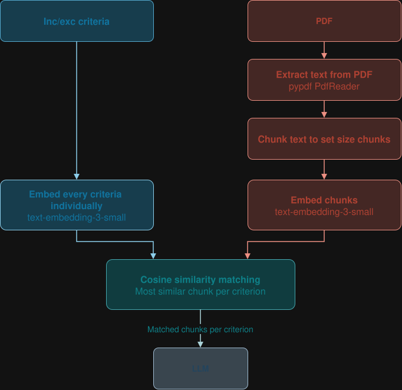
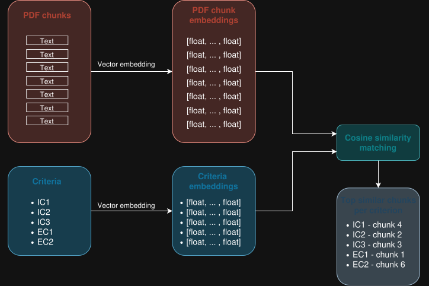

# PDF Screening

## PDF screening pipeline

PDF text is extracted using pypdf and the extracted text is split into chunks using LangChain's RecursiveCharacterTextSplitter, with a set chunk size and overlap. Each chunk is embedded with OpenAI's text-embedding-3-small model, and the chunks and their embeddings are cached in the database. Every inclusion and exclusion criterion is embedded with the same model, and the embeddings are also cached.

For each criterion, the top-1 most similar chunk is retrieved based on cosine similarity. The number of chunks sent to the LLM depends on the number of criteria. For example, with 6 criteria, up to 6 chunks are sent. The chunks are sent to the LLM in place of the abstract.

## More detailed look
